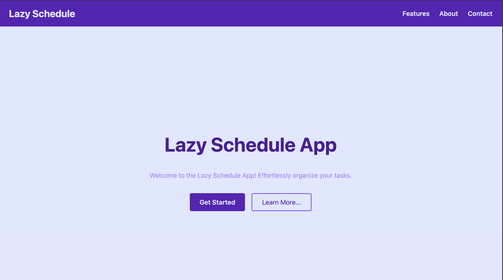

# Lazy Schedule App

A modern, mobile-friendly 24-hour schedule planner built with **React**, **TypeScript**, **Vite**, and **Tailwind CSS**.  
Effortlessly organize your day with an interactive SVG clock, color-coded tasks, and smooth navigation.

---

## ✨ Features

- **Interactive 24-Hour Clock:**  
  Visualize your schedule with a circular SVG clock face.

- **Task Scheduling:**  
  Add, color, and label time blocks for any hour of the day.

- **Responsive Design:**  
  Fully mobile-friendly with a hamburger menu and touch-friendly controls.

- **Smooth Section Navigation:**  
  Jump to Features, About, or Contact from anywhere in the app.

- **Custom Color Palette:**  
  Harmonious brand and Sanzo Wada-inspired colors for a beautiful UI.

---

## 🔗 Live Demo

👉 [https://lazyschedule.netlify.app](https://lazyschedule.netlify.app)

---

## 🖼️ Screenshots

| Home View | Clock View |
|-----------|------------|
|  |  |


---

## 🚀 Getting Started

Clone the repository and install dependencies:

```bash
git clone https://github.com/veefa/lazy-schedule-app-0.git
cd lazy-schedule-app-0
npm install
```

Start the development server:

```bash
npm run dev
```

Then open your browser and go to [http://localhost:5173](http://localhost:5173)

---

## 💡 Motivation

This project was built to:
- Practice advanced React + TypeScript patterns
- Explore SVG-based user interfaces for visual task planning
- Improve performance and user experience with Vite + Tailwind CSS
- Build a polished, professional portfolio-ready app

---

## 🛠️ Tech Stack

- [React](https://react.dev/)
- [TypeScript](https://www.typescriptlang.org/)
- [Vite](https://vitejs.dev/)
- [Tailwind CSS](https://tailwindcss.com/)
- [React Router](https://reactrouter.com/)
- [Netlify](https://www.netlify.com/) – Deployment

---

## 📱 Mobile Friendly

- Responsive layouts and navigation
- Touch-friendly buttons and inputs
- Optimized for all screen sizes

---

## 📂 Project Structure

```
src/
  components/       # Navbar, Home, About, Contact, Footer
  features/
    schedule/       # FaceClock and scheduling logic
  pages/            # LazySchedulePage
  App.tsx
  main.tsx
  index.css
```

---

## 🙌 Acknowledgements

- [Sanzo Wada Color Palette](https://www.sanzowada.com/)
- [Vite](https://vitejs.dev/)
- [Tailwind CSS](https://tailwindcss.com/)

---

## 🤝 Contributing

Contributions, suggestions, and feature requests are welcome!  
Feel free to fork the project, open an issue, or submit a pull request.

---

## 📄 License

This project is open-source under the [MIT License](LICENSE).

---

**Enjoy organizing your day with Lazy Schedule!** ⏰
